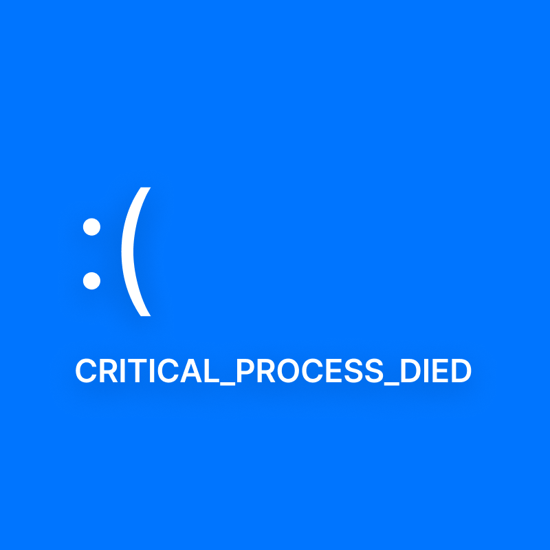

# Critical_Process_Died 의 Play_Us 소스코드

2023 경기도연한해커톤에 출전하는 일산대진고학생 2명의 일주일간 밤낮 없이 개발한 코드를 담았습니다!

# 팀원과의 인터뷰...

🤔 이 앱은 어떤 앱 인가요?  
😀 여러분들이 친구 만나러 갈 때, 아니면 약속 정할 때! 많은 어려움이 있지 않았나요? 그 고민을 해결해줄 Play_Us! 고민은 만남을 늦출 뿐. 어서 Play_Us를 키자구요!

------------------

😮 이거를 하나하나 다 만드신거에요??  
😵‍💫 그렇습니다! 이거 만든다고 개발자 분이 갈려나갔다고...(디자이너랑 앱 개발자가 디자인 하다가 컴퓨터 앞에서 잠들었다고...)

------------------

# 이 팀원을 소개해볼까요?
🏆 그렇게 화려하지는 않아도 한번 담아 봤습니다!
## 김재윤 (a.k.a 삐약이, BBIYAYEE7)
* 2022 교내 해커톤 최종 우승
* 2022 교내 메이커톤 최종 4위
* 제4회 한국코드페어 SW공모전 최종 13위
* 제1회 IT코딩경진대회 최종 동상 수상
* 2023 교내 해커톤 최종 준우승
* 2023 교내 메이커톤 최종 준우승
* 2023 경기창고 최종 준우승
* 제5회 한국코드페어 SW공모전 최종 대상 수상

## 최민호 (a.k.a  마이노, 스마또데이비드)
* 2023 교내 해커톤 최종 준우승
* 2023 교내 메이커톤 최종 준우승
* 2023 경기창고 최종 준우승
